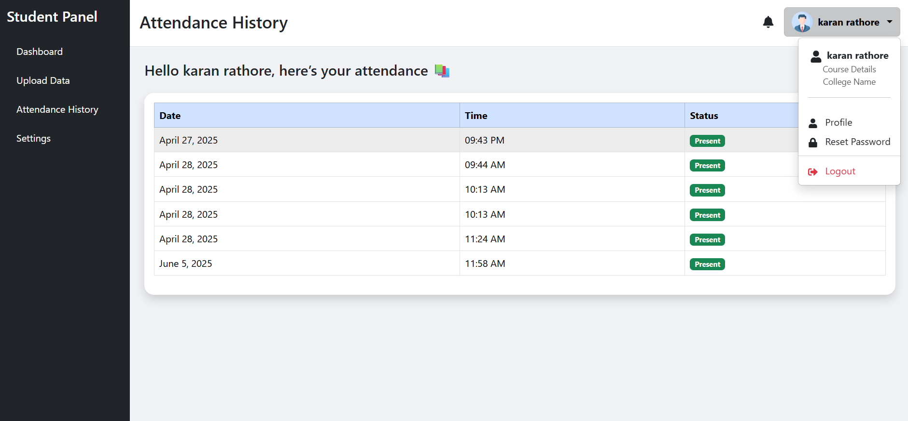

# Face Recognition Attendance Management System

A full stack web application for managing student and teacher attendance using face recognition technology.  
Built with **React.js** (frontend), **Node.js/Express** (backend), **MongoDB** (database), and **Python (Flask + OpenCV + MediaPipe + face_recognition)** for face encoding and verification.

---

## 🚀 Features

- Student and Teacher registration with face data
- Secure login (password & face recognition)
- Attendance marking via face scan
- Separate dashboards for students and teachers
- Attendance history and analytics
- Modern, responsive UI

---

## 🗂️ Project Structure

```
Finalproject/
├── Clients/                # Frontend (React.js)
│   ├── src/
│   │   ├── App.jsx
│   │   ├── ContextAuth.jsx
│   │   ├── Login.jsx
│   │   ├── LoginwithFace.jsx
│   │   ├── Landing_page/
│   │   ├── StudentDb/
│   │   └── TeachersDB/
│   ├── public/
│   ├── package.json
│   └── ...
├── Server/                 # Backend (Node.js/Express)
│   ├── app.js
│   ├── Controller/
│   ├── models/
│   ├── routes/
│   ├── package.json
│   └── ...
├── encode_faces.py         # Python Flask API for face encoding/verification
├── assets/                 # Project screenshots and images
│   ├── landing.png
│   └── attendancedashboard.png
├── README.md
└── ...
```

---

## 🛠️ Tech Stack

- **Frontend:** React.js, Vite, Context API
- **Backend:** Node.js, Express.js, MongoDB, Mongoose
- **Face Recognition:** Python, Flask, OpenCV, MediaPipe, face_recognition
- **Authentication:** JWT, bcrypt
- **Other:** CORS, REST API, Axios

---

## 📸 Screenshots

Landing Page  


Attendance Dashboard  


---

## ⚙️ Setup & Installation

### 1. Clone the Repository

```bash
git clone https://github.com/yourusername/your-repo-name.git
cd your-repo-name
```

### 2. Start the Python Face API

- Install Python dependencies:
  ```bash
  pip install flask flask-cors pymongo pillow opencv-python mediapipe face_recognition
  ```
- Run the Flask server:
  ```bash
  python encode_faces.py
  ```
  The API will run on `http://localhost:5000`.

### 3. Setup the Backend (Node.js/Express)

- Go to the Server folder:
  ```bash
  cd Server
  npm install
  ```
- Create a `.env` file for environment variables (MongoDB URI, JWT secret, etc.).
- Start the backend server:
  ```bash
  npm start
  ```
  The backend will run on `http://localhost:PORT` (default: 8000).

### 4. Setup the Frontend (React)

- Go to the Clients folder:
  ```bash
  cd ../Clients
  npm install
  ```
- Start the React app:
  ```bash
  npm run dev
  ```
  The frontend will run on `http://localhost:5173` (or as configured).

---

## 📝 Usage Guide

1. **Register as Student/Teacher:**  
   Sign up and upload your face data (front, left, right images).

2. **Login:**  
   Use your credentials or face recognition to log in.

3. **Mark Attendance:**  
   Teachers can mark attendance by scanning students’ faces.

4. **View Attendance:**  
   Both students and teachers can view attendance records and analytics.

---

## 🧑‍💻 Contributing

Pull requests are welcome! For major changes, please open an issue first to discuss what you would like to change.

---

## 📄 License

[MIT](LICENSE)

---

## 🙏 Acknowledgements

- [face_recognition](https://github.com/ageitgey/face_recognition)
- [MediaPipe](https://mediapipe.dev/)
- [OpenCV](https://opencv.org/)
- [MongoDB](https://www.mongodb.com/)
- [React](https://react.dev/)
- [Node.js](https://nodejs.org/)

---

> **Made with ❤️ for learning and innovation.**
